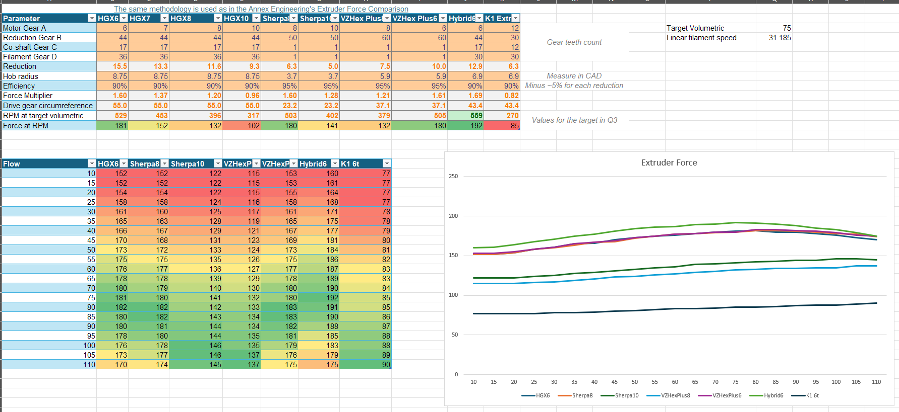

# Extruder Force Simulator
A simple simulator that uses the same approach as [Annex Engineering's "Extruder Force Comparison"](https://github.com/Annex-Engineering/Annex-Engineering.github.io/blob/master/extruder_force.md) and uses their torque curve data for the LDO-36STH20 motor.

It allows calculating RPM and torque for different gear configurations, as well as plotting them on a chart for comparison:

